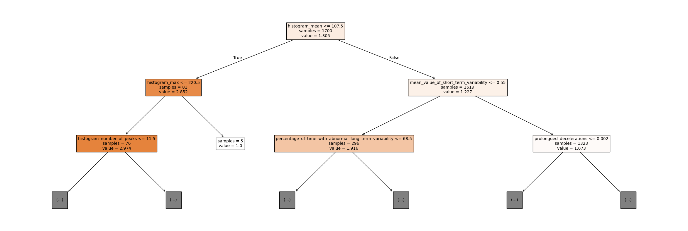
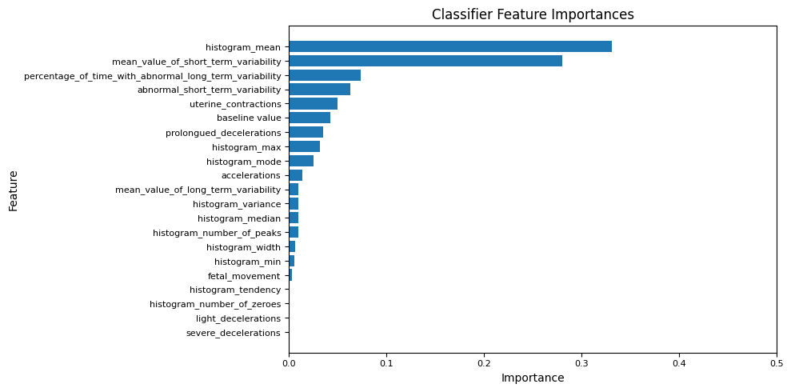
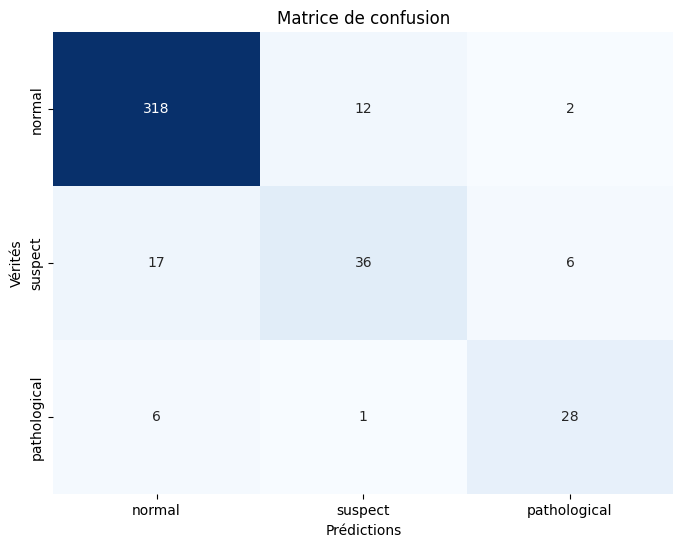

# Rapport

## Introduction

Ce rapport présente les résultats que nous avons obtenus durant l'analyse du dataset de cardiotocographie dans le contexte de la santé des foetus.

## Modèles prédictifs

Nous avons essayé plusieurs modèles de Machine Learning afin de déterminer dans quelle mesure il était possible de prédire avec précision la santé foetale à partir des données d'un examen de cardiotocographie.

Les modèles que nous avons essayé sont les suivants : Decision Tree, Random Forest, Adaboost, XGBoost, Réseau de neurones (MLP). Le modèle qui nous a donné les meilleurs résultats est la Random Forest, avec une précision, un rappel et une accuracy tous égal à 93%. Au delà du choix du modèle, nous n'avons pas cherché à optimiser les meilleurs hyperparamètres car c'est une étape qui peut prendre du temps et ce n'était pas l'objectif premier du projet. Cela dit, certaines personnes ont réussi à atteindre des scores jusqu'à 99% avec une Random Forest (https://www.kaggle.com/code/pariaagharabi/step-by-step-fetal-health-prediction-99-detailed/log).

Au final, nous avons retenu deux modèles :
1. L'arbre de décision (Decision Tree) pour son interprétabilité
2. La Random Forest pour ses performances (légèrement meilleure avec 3% d'accuracy en plus)

## Explicabilité

Dans cette section, nous détaillerons ce que nous avons pu observer en utilisant diverses méthodes d'explicabilité pour comprendre l'arbre de décision. Bien qu'un arbre de décision soit interprétable par nature, l'arbre en question contient un très grand nombre de noeuds. En pratique, il serait donc relativement difficile et long de l'interpréter visuellement.

### Arbre de décision

L'arbre de décision obtenu est le suivant :

Il ne s'agit ici que des 2 premiers niveaux de l'arbre car le modèle complet est beaucoup plus grand.

### Variables importantes

Voici les caractéristiques les plus importantes de l'arbre :

On peut voir que les deux caractéristiques les plus importantes sont :
- `histogram_mean` : Cette variable correspond à la valeur moyenne de l'histogramme du rythme cardiaque du foetus. En d'autres termes, il s'agit de son rythme cardiaque moyen.
- `mean_value_of_short_term_variability` : Il s'agit de la variation du rythme cardiaque du foetus.

Ces deux variables sont les principaux indicateurs permettant de diagnostiquer un foetus comme étant "à risque" ou non. Pour aller plus en détail, on peut se pencher sur la question de l'intensité du diagnostic. En d'autres termes, à quel point le modèle différencie bien les cas "suspects" et "pathologiques". Pour cela, on peut jeter un oeil à la matrice de confusion du modèle :

### Erreurs de prédictions

Il est difficile de tirer une conclusion à partir des résultats obtenus. En effet les classes "pathologiques" et "suspect" sont beaucoup moins représentées que la classe normale.

| Classe\Métrique | précision | rappel | f1   | support |
|-----------------|-----------|--------|------|---------|
| normal          | 0.93      | 0.96   | 0.95 | 332     |
| suspect         | 0.73      | **0.61**   | 0.67 | 59      |
| pathological    | 0.78      | 0.80   | 0.79 | 35      |

Ce qui ressort du tableau ci-dessus est le rappel de la classe "suspect". Il s'agit de la proportion des cas suspects correctement identifiés. Cette valeur est très basse et lorsque on compare avec la matrice de confusion, on peut voir que la plupart des cas incorrectement identifiés sont des faux négatifs donc un sous-diagnostic au lieu de l'inverse (qui serait peut-être préférable).

### Limitations du modèle et recommandations

La prédiction du modèle offre un très bon premier avis sur lequel le corps médical peut se baser. Cela dit, il peut arriver que le modèle se trompe et prédise un cas "pathologique" alors qu'il n'y a en fait pas de problème. Déclencher un suivi intensif entraîne des coûts ainsi que de nombreuses ressources (équipement, personnel, etc...), sans parler du stress que cela peut infliger au patient. Pour cette raison, les prédictions du modèle devraient systématiquement être revues/vérifiées par un vrai médecin et un suivi intensif ne devrait être déclenchée que sur la demande d'un médecin qualifié.